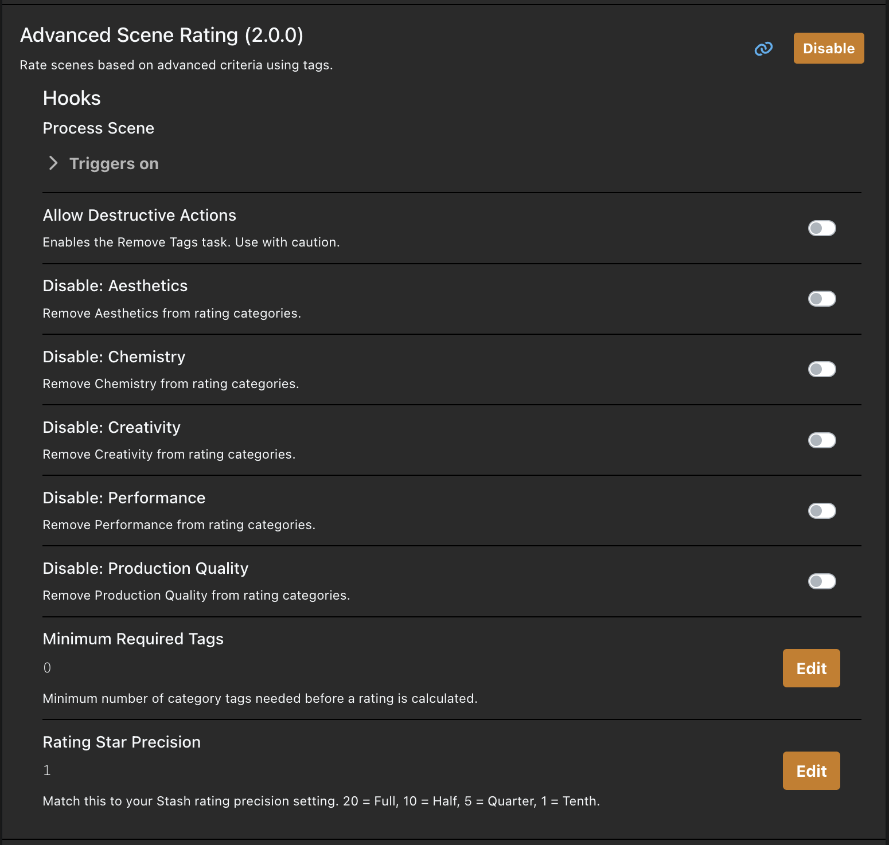

# Advanced Scene Rating

A Stash plugin that adds a multi-category rating system for scenes. Instead of a single star rating, you rate scenes across configurable criteria — the plugin then calculates an overall score and sets the Stash rating automatically.

## Credits

Inspired by the [Advanced Rating System](https://discourse.stashapp.cc/t/advanced-rating-system/3096) plugin on the Stash community forums, which introduced the concept of using tags for multi-category ratings. This plugin builds on that idea with a full interactive UI modal and configurable categories.

## Requirements

- [Stash](https://stashapp.cc) v0.27+
- Python 3.x
- [stashapp-tools](https://github.com/stg-annon/stashapp-tools): `pip install stashapp-tools`

## Installation

1. Download this repository (Code → Download ZIP) and extract it
2. Place the extracted folder inside a category subfolder of your Stash plugins directory:
   - **Linux/Mac:** `~/.stash/plugins/Utilities/Advanced Scene Rating/`
   - **Windows:** `%USERPROFILE%\.stash\plugins\Utilities\Advanced Scene Rating\`

   > The plugin must be **two levels deep** inside the plugins directory — `plugins/Category/Plugin/`. Placing it directly under `plugins/` will cause it not to appear in Stash.

3. In Stash, go to **Settings → Plugins** and click **Reload Plugins**
4. Enable **Advanced Scene Rating**
5. Run the **Create Tags** task to generate the rating tag hierarchy

## Usage

Click the **★+** button on any scene's page to open the rating modal.

Rate each category using the 1–5 star selectors. Hover over the ⓘ icon next to a category name to see a description of what it rates. When you close the modal the overall scene rating is calculated and set automatically.

The rating is visible directly on the scene page alongside the category tags that were assigned. The overall rating is the average of all rated categories mapped to Stash's 0–100 scale.

## Configuration

Go to **Settings → Plugins → Advanced Scene Rating** to configure:

| Setting | Description |
|---|---|
| Disable: Production Quality | Remove Production Quality from rating |
| Disable: Chemistry | Remove Chemistry from rating |
| Disable: Performance | Remove Performance from rating |
| Disable: Aesthetics | Remove Aesthetics from rating |
| Disable: Creativity | Remove Creativity from rating |
| Rating Star Precision | Match to your Stash rating precision: `20` = Full, `10` = Half, `5` = Quarter, `1` = Tenth (default: `10`) |
| Minimum Required Tags | How many categories must be rated before a score is calculated (default: `5`) |
| Allow Destructive Actions | Must be enabled before the Remove Tags task will run (default: `false`) |

All categories are active by default — check a box to disable that category.

After changing precision, run **Process All Scenes** to retroactively recalculate existing ratings.

## Tasks

- **Process All Scenes** — Recalculates ratings for every scene based on their existing tags
- **Create Tags** — Creates the rating tag hierarchy under an "Advanced Rating System" parent tag
- **Remove Tags** — Deletes all rating tags (requires Allow Destructive Actions to be enabled)

## How It Works

Each category gets a tag in the format `Category: N` (e.g. `Performance: 4`). When a scene is updated, the hook reads those tags, averages the scores, and sets the Stash rating. Tags are organised in a hierarchy: `Advanced Rating System > Category > Category: N`.
